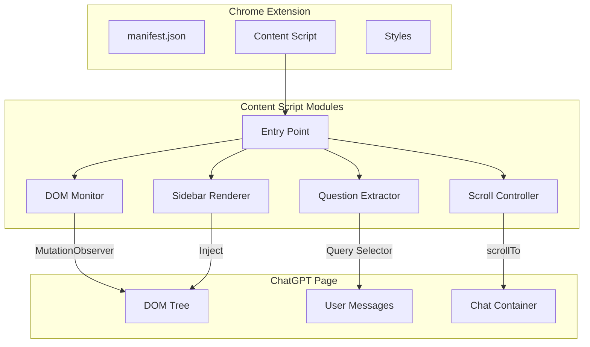
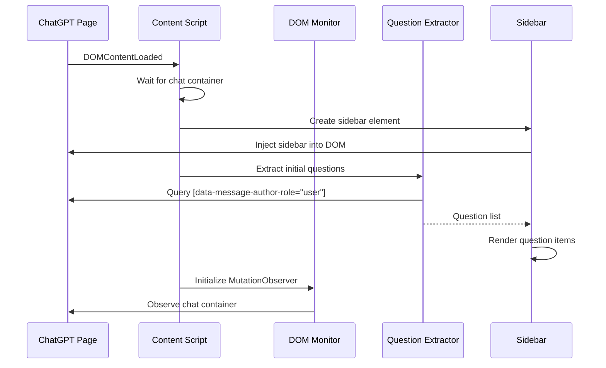
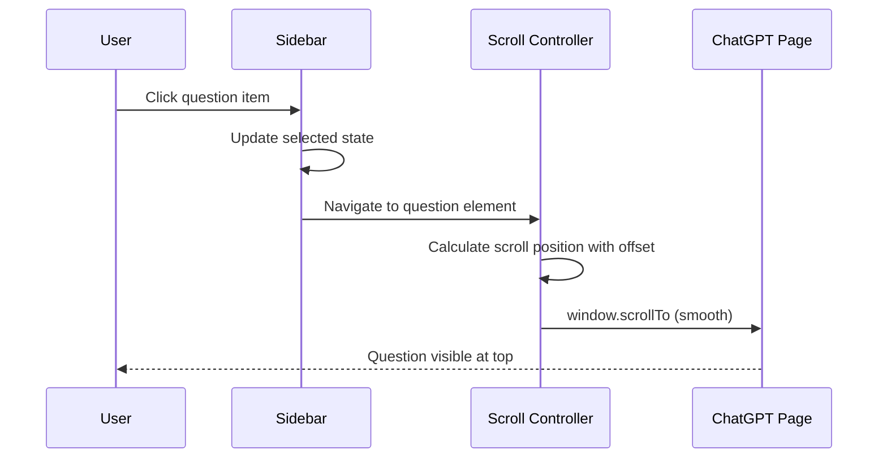
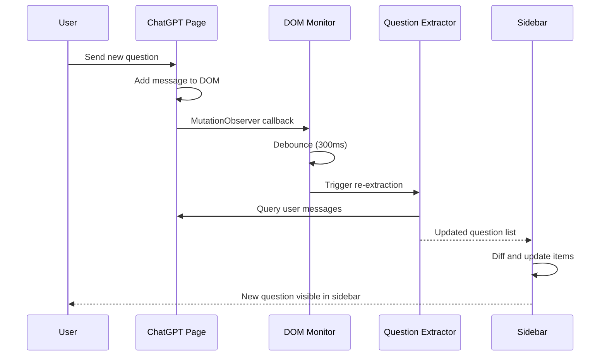
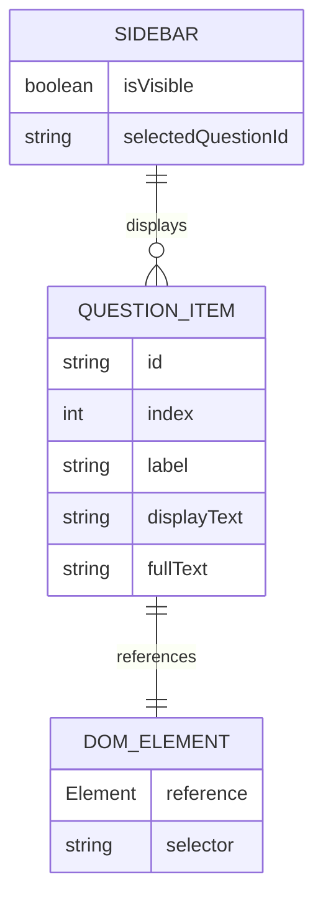

# Technical Design Document

## Overview

**Purpose**: The ChatGPT Question Navigator Chrome Extension delivers enhanced conversation navigation to ChatGPT users by providing a persistent sidebar that displays all user questions with click-to-scroll functionality.

**Users**: ChatGPT power users who engage in lengthy conversations will utilize this extension to quickly overview their questions and navigate to specific points in their chat history without manual scrolling.

**Impact**: This is a greenfield Chrome Extension that operates independently alongside ChatGPT's web interface, requiring no modifications to the host application.

### Goals
- Provide instant visual overview of all user questions in a conversation
- Enable single-click navigation to any question in the chat
- Automatically detect and display new questions in real-time
- Maintain performance parity with native ChatGPT experience

### Non-Goals
- Search or filter functionality for questions
- AI-powered summarization or tagging
- Support for LLM services other than ChatGPT
- Conversation tree visualization
- Data persistence or export capabilities

---

## Architecture

### High-Level Architecture



### Technology Stack

| Layer | Technology | Rationale |
|-------|------------|-----------|
| Extension Platform | Chrome Extension Manifest V3 | Required for Chrome Web Store distribution; provides content script injection |
| Language | TypeScript | Type safety, better IDE support, catches errors at compile time |
| DOM Observation | MutationObserver API | Native browser API for efficient DOM change detection |
| Styling | Vanilla CSS | Minimal footprint, no runtime dependencies, scoped to extension elements |
| Build Tool | esbuild or Vite | Fast TypeScript compilation with minimal configuration |

### Key Design Decisions

#### Decision 1: Content Script Only Architecture

- **Decision**: Implement the extension using only content scripts without background service workers
- **Context**: The extension only needs to interact with the ChatGPT page DOM; no cross-tab communication, storage sync, or external API calls are required
- **Alternatives**:
  1. Background service worker with message passing
  2. Hybrid approach with background for state management
- **Selected Approach**: Single content script that initializes on page load, manages its own state in memory, and directly manipulates the DOM
- **Rationale**: Simplest architecture that meets all requirements; eliminates complexity of message passing and service worker lifecycle management
- **Trade-offs**: Cannot share state across tabs (acceptable for v1); extension state resets on page refresh (acceptable behavior)

#### Decision 2: Data Attribute-Based DOM Selection

- **Decision**: Use `data-message-author-role` attribute exclusively for identifying user messages
- **Context**: ChatGPT's class names change frequently with deployments, but data attributes for accessibility remain stable
- **Alternatives**:
  1. CSS class-based selectors
  2. XPath queries
  3. Text content pattern matching
- **Selected Approach**: Single attribute selector `[data-message-author-role="user"]`
- **Rationale**: Data attributes are semantic, stable across UI updates, and performant for querySelectorAll operations
- **Trade-offs**: Dependent on OpenAI maintaining this attribute; extension breaks if attribute is removed (low risk based on accessibility requirements)

#### Decision 3: Debounced MutationObserver Pattern

- **Decision**: Use MutationObserver with debounced callback for DOM change detection
- **Context**: ChatGPT's SPA architecture causes frequent DOM mutations during message streaming and UI updates
- **Alternatives**:
  1. Polling-based detection
  2. Raw MutationObserver without debouncing
  3. Event delegation on chat container
- **Selected Approach**: MutationObserver monitoring `childList` and `subtree` changes with 300ms debounce
- **Rationale**: Efficient detection without performance overhead; debouncing prevents excessive re-renders during rapid updates
- **Trade-offs**: 300ms delay before sidebar updates (imperceptible to users); may miss intermediate states (not relevant for question counting)

---

## System Flows

### Extension Initialization Flow



### Question Navigation Flow



### Real-time Update Flow



---

## Requirements Traceability

| Req | Summary | Components | Interfaces | Flows |
|-----|---------|------------|------------|-------|
| 1.1-1.5 | Sidebar Display | SidebarRenderer | createSidebar(), injectSidebar() | Initialization Flow |
| 2.1-2.6 | Question Detection | QuestionExtractor | extractQuestions(), formatQuestionText() | Initialization Flow |
| 3.1-3.6 | List Interaction | SidebarRenderer, ScrollController | handleQuestionClick(), scrollToQuestion() | Navigation Flow |
| 4.1-4.5 | Real-time Updates | DOMMonitor | startObserving(), handleMutations() | Update Flow |
| 5.1-5.4 | Page Compatibility | manifest.json, ContentScript | matches, run_at | Initialization Flow |
| 6.1-6.5 | Performance | DOMMonitor, QuestionExtractor | debounce(), querySelectorAll() | All Flows |

---

## Components and Interfaces

### Entry Point

#### ContentScript (content_script.ts)

**Responsibility & Boundaries**
- **Primary Responsibility**: Bootstrap extension on ChatGPT pages and coordinate module initialization
- **Domain Boundary**: Extension lifecycle management
- **Data Ownership**: None; delegates to specialized modules

**Dependencies**
- **Inbound**: Chrome extension runtime (injection)
- **Outbound**: DOMMonitor, QuestionExtractor, SidebarRenderer, ScrollController

**Contract Definition**

```typescript
interface ContentScriptConfig {
  chatContainerSelector: string;
  userMessageSelector: string;
  debounceMs: number;
  scrollOffsetPx: number;
}

// Entry point - no public interface, self-initializing module
// Initializes on DOMContentLoaded or immediately if document already loaded
```

---

### DOM Layer

#### DOMMonitor (utils/domMonitor.ts)

**Responsibility & Boundaries**
- **Primary Responsibility**: Observe DOM changes in the chat container and notify subscribers
- **Domain Boundary**: DOM observation and change detection
- **Data Ownership**: MutationObserver instance and callback registry

**Dependencies**
- **Inbound**: ContentScript
- **Outbound**: Browser MutationObserver API

**Contract Definition**

```typescript
interface DOMMonitor {
  /**
   * Start observing the chat container for changes
   * @param container - The DOM element to observe
   * @param onMutation - Callback invoked when relevant mutations occur (debounced)
   */
  startObserving(container: Element, onMutation: () => void): void;

  /**
   * Stop observing and clean up resources
   */
  stopObserving(): void;

  /**
   * Check if currently observing
   */
  isObserving(): boolean;
}

interface DOMMonitorConfig {
  debounceMs: number;
  observerOptions: MutationObserverInit;
}
```

**Preconditions**: Container element must exist in DOM before calling startObserving
**Postconditions**: onMutation callback will be invoked at most once per debounce window
**Invariants**: Only one observer instance active at a time

---

#### DOMSelectors (utils/domSelectors.ts)

**Responsibility & Boundaries**
- **Primary Responsibility**: Centralize all DOM selector strings for maintainability
- **Domain Boundary**: Selector configuration
- **Data Ownership**: Selector constant values

**Contract Definition**

```typescript
interface DOMSelectors {
  readonly USER_MESSAGE: string;           // '[data-message-author-role="user"]'
  readonly CHAT_CONTAINER: string;         // '[role="presentation"]'
  readonly CHAT_CONTAINER_FALLBACK: string; // 'main'
}

/**
 * Find the chat container element, trying primary selector then fallback
 * @returns The container element or null if not found
 */
function findChatContainer(): Element | null;
```

---

### Question Processing Layer

#### QuestionExtractor (utils/questionExtractor.ts)

**Responsibility & Boundaries**
- **Primary Responsibility**: Extract and format user questions from the DOM
- **Domain Boundary**: Question data extraction and transformation
- **Data Ownership**: None; stateless utility

**Dependencies**
- **Inbound**: ContentScript, DOMMonitor callback
- **Outbound**: DOMSelectors

**Contract Definition**

```typescript
interface Question {
  id: string;           // Unique identifier (index-based)
  index: number;        // 0-based position in conversation
  element: Element;     // Reference to DOM element for scrolling
  fullText: string;     // Complete question text
  displayText: string;  // Truncated text for sidebar display
  label: string;        // "Q1", "Q2", etc.
}

interface QuestionExtractor {
  /**
   * Extract all user questions from the current DOM state
   * @returns Array of Question objects in chronological order
   */
  extractQuestions(): Question[];
}

interface QuestionExtractorConfig {
  maxDisplayLength: number;  // 80 characters
  ellipsis: string;          // '...'
}
```

**Preconditions**: DOM must be in a stable state (not mid-render)
**Postconditions**: Returns empty array if no questions found; never throws
**Invariants**: Question order matches DOM order; indices are sequential starting from 0

---

### UI Layer

#### SidebarRenderer (sidebar.ts)

**Responsibility & Boundaries**
- **Primary Responsibility**: Create, render, and manage the sidebar UI component
- **Domain Boundary**: Sidebar DOM structure and visual state
- **Data Ownership**: Sidebar element reference, selected question state

**Dependencies**
- **Inbound**: ContentScript
- **Outbound**: ScrollController (via click handlers)

**Contract Definition**

```typescript
interface SidebarRenderer {
  /**
   * Create and inject the sidebar into the page
   * @returns The created sidebar container element
   */
  createSidebar(): HTMLElement;

  /**
   * Update sidebar content with new question list
   * @param questions - Array of questions to display
   */
  updateQuestions(questions: Question[]): void;

  /**
   * Set the currently selected question (visual highlight)
   * @param questionId - ID of question to select, or null to clear selection
   */
  setSelectedQuestion(questionId: string | null): void;

  /**
   * Remove sidebar from DOM and clean up event listeners
   */
  destroy(): void;
}

interface SidebarConfig {
  width: string;        // '240px'
  zIndex: number;       // 10000
  position: 'right';
}

// CSS Classes (defined in styles.css)
interface SidebarCSSClasses {
  container: 'cgpt-nav-sidebar';
  header: 'cgpt-nav-header';
  list: 'cgpt-nav-list';
  item: 'cgpt-nav-item';
  itemHover: 'cgpt-nav-item--hover';
  itemSelected: 'cgpt-nav-item--selected';
  label: 'cgpt-nav-label';
  text: 'cgpt-nav-text';
  empty: 'cgpt-nav-empty';
}
```

**Preconditions**: Document body must exist before createSidebar is called
**Postconditions**: Sidebar is visible and interactive after createSidebar completes
**Invariants**: Only one sidebar instance exists at a time

---

#### ScrollController (utils/scrollController.ts)

**Responsibility & Boundaries**
- **Primary Responsibility**: Handle smooth scrolling to question elements
- **Domain Boundary**: Scroll behavior and positioning
- **Data Ownership**: None; stateless utility

**Dependencies**
- **Inbound**: SidebarRenderer (via click handler)
- **Outbound**: Browser scroll APIs

**Contract Definition**

```typescript
interface ScrollController {
  /**
   * Scroll the page to bring the target element into view
   * @param element - The DOM element to scroll to
   * @param offsetPx - Pixels from top of viewport (default: 80)
   */
  scrollToElement(element: Element, offsetPx?: number): void;
}

interface ScrollConfig {
  behavior: 'smooth' | 'instant';
  defaultOffsetPx: number;  // 80
}
```

**Preconditions**: Element must be attached to DOM
**Postconditions**: Element's top edge is positioned at (viewport top + offset)
**Invariants**: Scroll behavior is always smooth unless overridden

---

## Data Models

### Domain Model



### Question Data Structure

```typescript
/**
 * Represents a user question extracted from the ChatGPT conversation
 */
interface Question {
  /** Unique identifier for this question instance */
  id: string;

  /** Zero-based index in conversation order */
  index: number;

  /** Display label (e.g., "Q1", "Q2") */
  label: string;

  /** Full question text with newlines replaced by spaces */
  fullText: string;

  /** Truncated text for sidebar display (max 80 chars) */
  displayText: string;

  /** Reference to the DOM element for scroll targeting */
  element: Element;
}

/**
 * Sidebar state managed by SidebarRenderer
 */
interface SidebarState {
  /** Currently displayed questions */
  questions: Question[];

  /** ID of the currently selected question, or null */
  selectedId: string | null;

  /** Whether sidebar has been injected into DOM */
  isInjected: boolean;
}
```

---

## Error Handling

### Error Strategy

The extension employs defensive programming with graceful degradation. All errors are caught and logged to console without disrupting the ChatGPT interface.

### Error Categories and Responses

| Category | Scenario | Response |
|----------|----------|----------|
| DOM Not Found | Chat container missing | Retry with exponential backoff (3 attempts), then disable silently |
| DOM Not Found | User message selector returns empty | Display empty state message in sidebar |
| DOM Changed | Expected attributes missing | Log warning, continue with available data |
| Scroll Failure | Target element removed | Clear selection, refresh question list |
| Observer Failure | MutationObserver disconnected | Attempt reconnection, fall back to manual refresh |

### Error Handling Implementation

```typescript
interface ErrorHandler {
  /**
   * Wrap function execution with error boundary
   * Logs errors to console but never throws
   */
  safeExecute<T>(fn: () => T, fallback: T): T;

  /**
   * Log error with extension context
   */
  logError(context: string, error: Error): void;
}
```

### Monitoring

- All errors logged to browser console with `[ChatGPT Navigator]` prefix
- No external error tracking in v1 (privacy consideration)
- User-visible errors shown as non-intrusive sidebar messages

---

## Testing Strategy

### Unit Tests

| Component | Test Focus |
|-----------|------------|
| QuestionExtractor | Text extraction, truncation at 80 chars, newline replacement, empty state |
| DOMSelectors | Selector string correctness, fallback logic |
| ScrollController | Offset calculation, smooth scroll invocation |
| Debounce utility | Timing behavior, callback coalescing |

### Integration Tests

| Scenario | Components | Verification |
|----------|------------|--------------|
| Initial Load | ContentScript → QuestionExtractor → SidebarRenderer | Sidebar displays all existing questions |
| New Question | DOMMonitor → QuestionExtractor → SidebarRenderer | New question appears in sidebar |
| Navigation | SidebarRenderer → ScrollController | Page scrolls to correct position |
| Conversation Switch | DOMMonitor → QuestionExtractor | Question list rebuilds correctly |

### E2E Tests (Manual)

| Test Case | Steps | Expected Result |
|-----------|-------|-----------------|
| Extension Activation | Navigate to chatgpt.com | Sidebar appears on right side |
| Question Display | Open conversation with 5+ messages | All user questions listed Q1-Qn |
| Click Navigation | Click Q3 in sidebar | Page scrolls to third question |
| Real-time Update | Send new question | New question appears at bottom of sidebar |
| Empty State | Open new empty conversation | Sidebar shows "No questions yet" |

---

## Security Considerations

### Content Security

- **No Remote Code**: Extension contains no remotely-hosted scripts (Manifest V3 requirement)
- **No eval()**: All code is statically compiled TypeScript
- **DOM Isolation**: Extension elements use unique class prefixes to avoid CSS conflicts

### Data Privacy

- **No Data Collection**: Extension reads DOM locally; no data transmitted externally
- **No Storage**: No use of chrome.storage or localStorage for conversation data
- **Session-Only State**: All state exists in memory and is cleared on page refresh

### Host Permission Scope

- **Minimal Permissions**: Only content script injection on ChatGPT domains
- **No Background Permissions**: No persistent background service worker
- **No Optional Permissions**: All permissions declared upfront in manifest

---

## File Structure

```
chatgpt-question-navigator/
├── manifest.json
├── src/
│   ├── content_script.ts      # Entry point, initialization
│   ├── sidebar.ts             # SidebarRenderer component
│   ├── styles.css             # Sidebar styling
│   └── utils/
│       ├── domSelectors.ts    # Centralized selectors
│       ├── domMonitor.ts      # MutationObserver wrapper
│       ├── questionExtractor.ts # Question extraction logic
│       ├── scrollController.ts  # Scroll handling
│       └── debounce.ts        # Debounce utility
├── dist/                      # Compiled output
├── tsconfig.json
├── package.json
└── README.md
```
